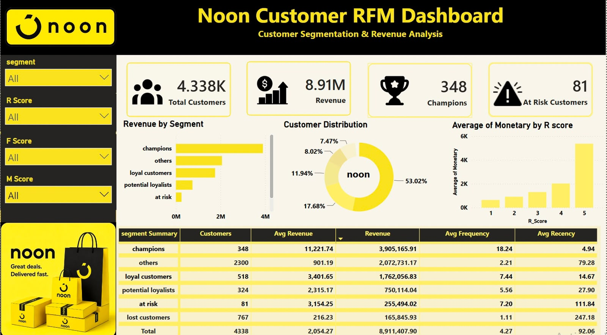

# Noon RFM Customer Analytics Dashboard

## Project Overview
This project analyzes customer behavior using the RFM (Recency, Frequency, Monetary) model. The dashboard was built in Power BI using SQL-prepared data to identify valuable customer segments and support business decisions.

## Tools Used
- SQL
- Power BI
- DAX

## KPIs
- Total Customers
- Total Revenue
- Champions
- At Risk Customers

## Dashboard Visuals
- Revenue by Segment
- Customer Distribution
- Average Monetary by R Score
- Segment Summary Table
- Interactive Slicers (Segment, R Score, F Score, M Score)

## Key Insights
- Champions generate the highest revenue.
- RFM segmentation helps identify loyal and at-risk customers.
- Interactive filters allow deeper customer analysis.

## Dashboard Preview

